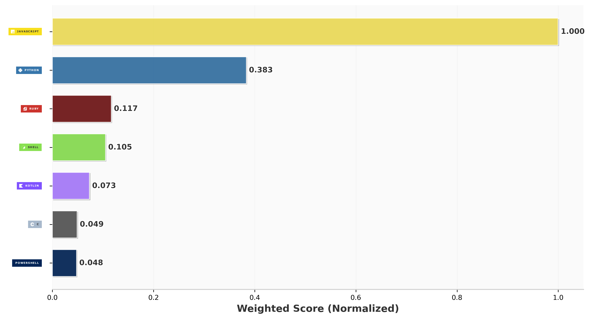

<h2 align="center">Hi ! This is my profile</h2>

###

  

###

###

  
  
  
  
  
  
  
  
  
  
  
  
  
  
  

 

<picture>
  <source media="(prefers-color-scheme: dark)" srcset="https://raw.githubusercontent.com/jimmxyz/jimmxyz/output/github-snake-dark.svg" />
  <source media="(prefers-color-scheme: light)" srcset="https://raw.githubusercontent.com/jimmxyz/jimmxyz/output/ocean.gif" />
  
</picture>

###

